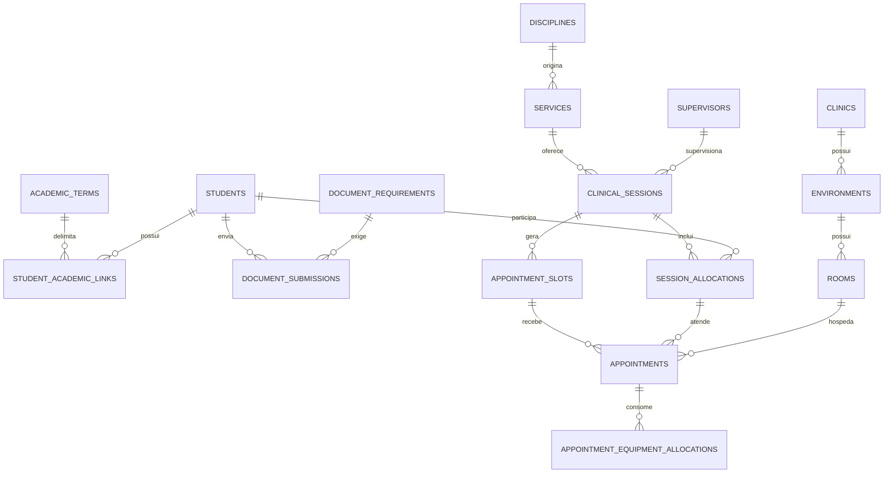

# Modelo de dados

Modelo relacional inicial. Todos os IDs sao UUID, datas de auditoria usam
`timestamptz` e tabelas mutaveis possuem `created_at` e `updated_at`.

## Infraestrutura

| Tabela | Campos principais | Restricoes relevantes |
| --- | --- | --- |
| `app_metadata` | key, value, created_at, updated_at | `key` e chave primaria; usada somente para metadados da infraestrutura |

## Identidade e pessoas

| Tabela | Campos principais | Restricoes relevantes |
| --- | --- | --- |
| `users` | id, email, password_hash, role, is_active, created_at, updated_at | id UUID; e-mail normalizado unico; role `MASTER`, `SUPERVISOR` ou `STUDENT`; senha somente como hash Argon2id |
| `students` | user_id, registration, full_name, phone | user e registration unicos |
| `supervisors` | user_id, kind, full_name, professional_area, max_students_default | kind em `PROFESSOR`, `PRECEPTOR`; limite > 0 |
| `student_availabilities` | id, student_id, term_id, weekday, start_time, end_time, time_zone | inicio < fim; fuso institucional |
| `supervisor_availabilities` | id, supervisor_id, term_id, weekday, start_time, end_time, time_zone | inicio < fim; fuso institucional |

Contato da comunidade nao cria `user`; pertence ao agendamento.

## Academico

| Tabela | Campos principais | Restricoes relevantes |
| --- | --- | --- |
| `academic_terms` | name, starts_on, ends_on, status | datas crescentes; status `DRAFT`, `ACTIVE`, `CLOSED`; no maximo um `ACTIVE` |
| `courses` | name, code, is_active | code unico |
| `disciplines` | course_id, name, code, kind, is_active | code unico; kind `DISCIPLINE` ou `INTERNSHIP` |
| `cohorts` | term_id, course_id, period, label, is_active | combinacao unica no semestre; periodo > 0 |
| `student_academic_links` | id, student_id, term_id, cohort_id, discipline_id | combinacao unica; turma e disciplina devem ser compativeis |
| `class_blocks` | id, cohort_id, discipline_id opcional, weekday, start_time, end_time, time_zone, is_active | dia 0-6; inicio < fim; fuso institucional |

Datas de semestre sao `date`; horarios recorrentes sao `time` no fuso
`America/Sao_Paulo`. A aplicacao valida sobreposicao usando intervalos
semiabertos `[inicio, fim)`, permitindo que um intervalo comece exatamente no
fim do anterior. Relacionamentos usam `RESTRICT`/preservacao logica para que
encerrar um semestre nao apague vinculos academicos nem disponibilidades
historicas.

## Documentos

| Tabela | Campos principais | Restricoes relevantes |
| --- | --- | --- |
| `document_requirements` | term_id, discipline_id opcional, name, expires_required, is_active | nome unico no escopo |
| `document_submissions` | requirement_id, student_id, storage_key, original_name, mime_type, size_bytes, status, expires_at, review_note, reviewed_by, reviewed_at | `storage_key` unico; status controlado |
| `audit_events` | actor_user_id opcional, action, target_type, target_id, occurred_at, metadata_json | append-only; metadata sem PII, nota ou conteudo de arquivo |

`document_submissions` e historica: reenvio cria linha nova. Uma consulta seleciona
a submissao aprovada e nao expirada para definir elegibilidade; o checklist
mostra a submissao mais recente. Estados permitidos sao `PENDING_REVIEW`,
`APPROVED`, `REJECTED` e `EXPIRED`. O storage key e gerado pelo servidor e o
volume fica fora da raiz publica.

## Clinicas, servicos e recursos

| Tabela | Campos principais | Restricoes relevantes |
| --- | --- | --- |
| `clinics` | name, address_label, is_active | nome unico |
| `environments` | clinic_id, name, is_active | nome unico por clinica |
| `rooms` | environment_id, name, is_active | nome unico por ambiente |
| `equipment_types` | name, is_active | nome unico; desativacao logica |
| `environment_equipments` | environment_id, equipment_type_id, quantity, is_active | quantidade >= 0; tipo unico por ambiente |
| `clinic_term_configs` | clinic_id, term_id, max_simultaneous_appointments, max_students | limites > 0; unico por clinica/semestre |
| `services` | discipline_id, name, duration_minutes, is_active | duracao > 0 |
| `service_equipment_requirements` | service_id, equipment_type_id, units_per_appointment | unidades > 0; tipo unico por servico |
| `supervisor_service_scopes` | supervisor_id, term_id, service_id, environment_id, can_review_documents, max_students_override, is_active | escopo unico; limite opcional > 0; desativacao logica |

Todos os relacionamentos de configuracao usam FK `RESTRICT`. A API valida que
clinica, ambiente, disciplina/curso, equipamento, servico e supervisor estejam
ativos antes de criar uma nova relacao. `environment_equipments.quantity` pode
ser zero; limites da clinica, duracao do servico, unidades por atendimento e
override do escopo devem ser positivos. `clinic_term_configs` e escopos sempre
referenciam um semestre, mantendo a configuracao isolada por `term_id`.

## Sessoes e agendamentos

| Tabela | Campos principais | Restricoes relevantes |
| --- | --- | --- |
| `clinical_sessions` | term_id, service_id, clinic_id, environment_id, supervisor_id, starts_at, ends_at, max_students_override, status | inicio < fim |
| `session_allocations` | session_id, student_id, status, suspended_reason | estudante unico por sessao |
| `appointment_slots` | session_id, starts_at, ends_at, capacity_total, reserved_count, version | intervalo unico por sessao; contagens >= 0 |
| `appointments` | slot_id, allocation_id, room_id, public_name, public_email opcional, public_phone opcional, status, risk_status, management_token_hash, idempotency_key | ao menos um contato; token hash unico; idempotencia unica por escopo |
| `appointment_equipment_allocations` | appointment_id, environment_equipment_id, quantity | quantidade > 0; par unico |
| `audit_events` | actor_user_id opcional, action, target_type, target_id, occurred_at, metadata_json | append-only |

Status de alocacao: `ACTIVE`, `SUSPENDED`, `CANCELLED`. Risco de agendamento:
`NONE`, `AT_RISK`, `RESOLVED`.

## Relacoes essenciais

## Integridade e concorrencia

- FKs usam `RESTRICT` para cadastros com historico; desativacao substitui delete.
- Um indice parcial garante no maximo um semestre `ACTIVE`.
- A reserva bloqueia slot, configuracao da clinica, inventarios necessarios e
  salas candidatas em ordem estavel antes de revalidar capacidade global.
- `reserved_count` e atualizado na mesma transacao do agendamento.
- Antes do commit, o servico revalida alocacao, sala, equipamentos e capacidade.
- `reserved_count` pode ficar temporariamente acima de `capacity_total` apenas
  quando uma dependencia cai depois da reserva; os agendamentos excedentes sao
  marcados `AT_RISK` e nenhuma nova reserva e aceita.
- Conflitos de intervalo devem receber indices adequados e, apos o MVP, podem
  ganhar `EXCLUDE USING gist` com ranges do PostgreSQL.
- Dados pessoais nao entram em `metadata_json` da auditoria.

## Dados derivados

`capacity_total`, `reserved_count` e `risk_status` sao derivados persistidos para
consulta rapida. Devem ser recalculados pelo servico de dominio quando uma
dependencia muda e cobertos por teste de consistencia. O frontend nunca os
calcula.
